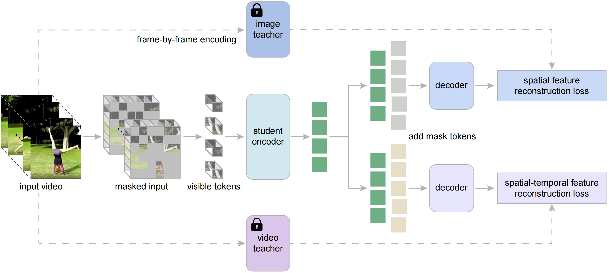

# Masked Video Distillation (CVPR 2023)

[](https://paperswithcode.com/sota/action-recognition-in-videos-on-something?p=masked-video-distillation-rethinking-masked)<br>
[](https://paperswithcode.com/sota/action-recognition-on-ava-v2-2?p=masked-video-distillation-rethinking-masked)
[](https://paperswithcode.com/sota/self-supervised-action-recognition-on-ucf101?p=masked-video-distillation-rethinking-masked)
[](https://paperswithcode.com/sota/self-supervised-action-recognition-on-hmdb51?p=masked-video-distillation-rethinking-masked)

Official PyTorch implementation of "[**Masked Video Distillation: Rethinking Masked Feature Modeling for Self-supervised Video Representation Learning**](https://arxiv.org/abs/2212.04500)".



## News

**[2023.4.9]** Code of MVD is available now! Pretrained models will be released soon. 
**[2023.2.28]** MVD is accepted by **CVPR 2023**.

## Main Results

### Something-Something V2

|  Method  | Pretrain Video Data | Backbone | Teacher | Epoch | Top-1 | Top-5 | resolution | #Frames x Clips x Crops | Param |
| :------: | :-----------------: | :------: | :-----: | :---: | :---: | :---: | :--------: | :---------------------: | :---: |
|   MVD    |    Kinetics-400     |  ViT-S   |  ViT-B  |  400  | 70.7  | 92.6  |    224     |         16x2x3          |  22M  |
|   MVD    |    Kinetics-400     |  ViT-S   |  ViT-L  |  400  | 70.9  | 92.8  |    224     |         16x2x3          |  22M  |
|   MVD    |    Kinetics-400     |  ViT-B   |  ViT-B  |  400  | 72.5  | 93.6  |    224     |         16x2x3          |  87M  |
|   MVD    |    Kinetics-400     |  ViT-B   |  ViT-L  |  400  | 73.7  | 94.0  |    224     |         16x2x3          |  87M  |
|   MVD    |    Kinetics-400     |  ViT-L   |  ViT-L  |  400  | 76.1  | 95.4  |    224     |         16x2x3          |  305M |
|   MVD    |    Kinetics-400     |  ViT-L   |  ViT-L  |  800  | 76.7  | 95.5  |    224     |         16x2x3          |  305M |
|   MVD    |    Kinetics-400     |  ViT-H   |  ViT-H  |  800  | 77.3  | 95.7  |    224     |         16x2x3          |  633M |

### Kinetics-400

|  Method  | Pretrain Video Data | Backbone | Teacher | Epoch | Top-1 | Top-5 | resolution | #Frames x Clips x Crops | Param |
| :------: | :-----------------: | :------: | :-----: | :---: | :---: | :---: | :--------: | :---------------------: | :---: |
|   MVD    |    Kinetics-400     |  ViT-S   |  ViT-B  |  400  | 80.6  | 94.7  |    224     |         16x5x3          |  22M  |
|   MVD    |    Kinetics-400     |  ViT-S   |  ViT-L  |  400  | 81.0  | 94.8  |    224     |         16x5x3          |  22M  |
|   MVD    |    Kinetics-400     |  ViT-B   |  ViT-B  |  400  | 82.7  | 95.4  |    224     |         16x5x3          |  87M  |
|   MVD    |    Kinetics-400     |  ViT-B   |  ViT-L  |  400  | 83.4  | 95.8  |    224     |         16x5x3          |  87M  |
|   MVD    |    Kinetics-400     |  ViT-L   |  ViT-L  |  400  | 86.0  | 96.9  |    224     |         16x5x3          |  305M |
|   MVD    |    Kinetics-400     |  ViT-L   |  ViT-L  |  800  | 86.4  | 97.0  |    224     |         16x5x3          |  305M |
|   MVD    |    Kinetics-400     |  ViT-H   |  ViT-H  |  800  | 87.3  | 97.4  |    224     |         16x5x3          |  633M |

### AVA v2.2

|  Method  | Pretrain Video Data | Extra Label | Backbone | Teacher | Epoch |  mAP  | #Frames x Sample Rate | Param |
| :------: | :-----------------: | :---------: | :------: | :-----: | :---: | :---: | :-------------------: | :---: |
|   MVD    |    Kinetics-400     |   &cross;   |  ViT-B   |  ViT-B  |  400  | 29.3  |         16x4          |  87M  |
|   MVD    |    Kinetics-400     |   &check;   |  ViT-B   |  ViT-B  |  400  | 33.6  |         16x4          |  87M  |
|   MVD    |    Kinetics-400     |   &cross;   |  ViT-B   |  ViT-L  |  400  | 31.1  |         16x4          |  87M  |
|   MVD    |    Kinetics-400     |   &check;   |  ViT-B   |  ViT-L  |  400  | 34.2  |         16x4          |  87M  |
|   MVD    |    Kinetics-400     |   &cross;   |  ViT-L   |  ViT-L  |  800  | 37.7  |         16x4          |  305M |
|   MVD    |    Kinetics-400     |   &check;   |  ViT-L   |  ViT-L  |  800  | 38.7  |         16x4          |  305M |
|   MVD    |    Kinetics-400     |   &cross;   |  ViT-H   |  ViT-H  |  800  | 40.1  |         16x4          |  633M |
|   MVD    |    Kinetics-400     |   &check;   |  ViT-H   |  ViT-H  |  800  | 41.1  |         16x4          |  633M |

### UCF101 & HMDB51

|  Method  | Pretrain Video Data | Backbone | Teacher | Epoch | UCF101 Top-1 | HMDB51 Top-1 |
| :------: | :-----------------: | :------: | :-----: | :---: | :----------: | :----------: |
|   MVD    |    Kinetics-400     |  ViT-B   |  ViT-B  |  400  |     97.0     |     76.4     |
|   MVD    |    Kinetics-400     |  ViT-B   |  ViT-L  |  400  |     97.5     |     79.7     |

## Installation

Please follow the instructions in [INSTALL.md](INSTALL.md).

## Data Preparation

Please follow the instructions in [DATASET.md](DATASET.md) for data preparation.

## Pre-training

The pre-training instruction is in [PRETRAIN.md](PRETRAIN.md).

## Fine-tuning with pre-trained models

The fine-tuning instruction is in [FINETUNE.md](FINETUNE.md).

## Model Zoo

We will provide pre-trained and fine-tuned models in [MODEL_ZOO.md](MODEL_ZOO.md) within days.

## Acknowledgements

This project is built upon [MAE](https://github.com/facebookresearch/mae) and [VideoMAE](https://github.com/MCG-NJU/VideoMAE). Thanks to the contributors of these great codebases.

## Citation

If this work is helpful for your research, please consider citing MVD.

```
@inproceedings{mvd,
  title={Masked Video Distillation: Rethinking Masked Feature Modeling for Self-supervised Video Representation Learning},
  author={Wang, Rui and Chen, Dongdong and Wu, Zuxuan and Chen, Yinpeng and Dai, Xiyang and Liu, Mengchen and Yuan, Lu and Jiang, Yu-Gang},
  booktitle={CVPR},
  year={2023}
}

@article{wang2022masked,
  title={Masked Video Distillation: Rethinking Masked Feature Modeling for Self-supervised Video Representation Learning},
  author={Wang, Rui and Chen, Dongdong and Wu, Zuxuan and Chen, Yinpeng and Dai, Xiyang and Liu, Mengchen and Yuan, Lu and Jiang, Yu-Gang},
  journal={arXiv preprint arXiv:2212.04500},
  year={2022}
}
```
